!SLIDE 
# Reading the Tea Leaves #
## Predicting the future with Ruby! ##
## ~ ##
### Roland Swingler :: @knaveofdiamonds :: LRUG feb 2012 ###

!SLIDE

!SLIDE 
# What is time series data? #

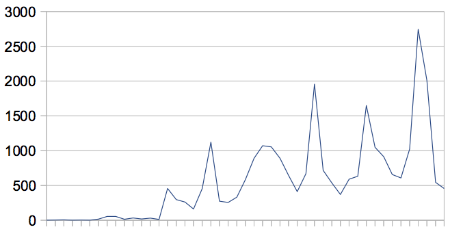

!SLIDE code

    @@@ ruby
    require 'tealeaves'

    @data   = [1.0, 2.3, ... 8.9]
    @period = 1

    TeaLeaves.forecast(@data, @period)
    # => 11.1

!SLIDE center
# Naïve Method #

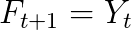

    @@@ ruby
    prediction = time_series.last

!SLIDE
# Moving Average #

    @@@ ruby
    [1,2,6,4,5].each_cons(3) do |slice|
    # yields slices
    # [1,2,6]
    # [2,6,4]
    # [6,4,5]

    slice.inject(&:+) / 3.0
    # => [3, 4, 5]

!SLIDE center

# What they look like #

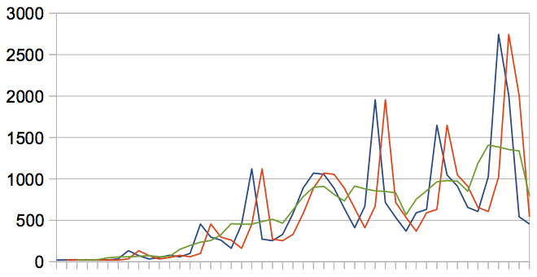

!SLIDE

# Single Exponetial Smoothing #

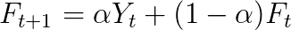

Initial Value for forecast:

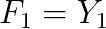

!SLIDE

# Single Exponetial Smoothing #

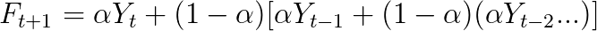

alpha between 0.0 and 1.0

!SLIDE

# Trend #

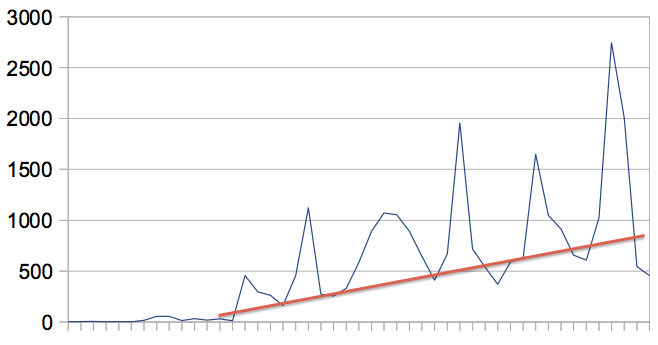

Can be Additive (Linear) or Multiplicative (Curved)

!SLIDE

# Add a trend term to SES #

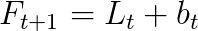

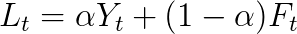

Initial value for trend:

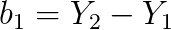

!SLIDE

# Trend might vary

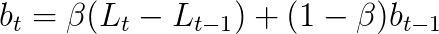

!SLIDE

# Seasonality #

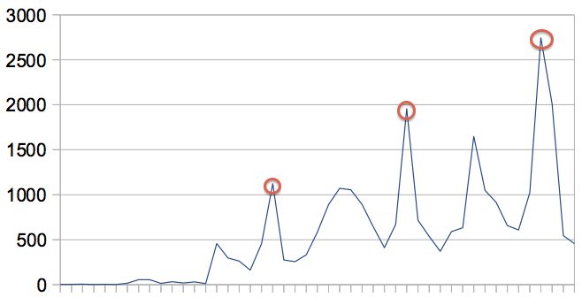

Can be Additive (Constant) or Multiplicative (Increasing)

!SLIDE

# Add in Seasonality #

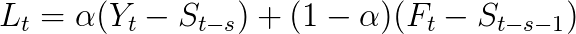

trend calculation the same as before

!SLIDE

# Seasonality may vary #

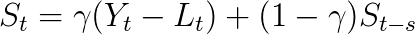

!SLIDE bullets center

# Finding the right model #

* Which type of trend, seasonality?
* How do we find alpha, beta and gamma?

!SLIDE

# Final tealeaf forecast #
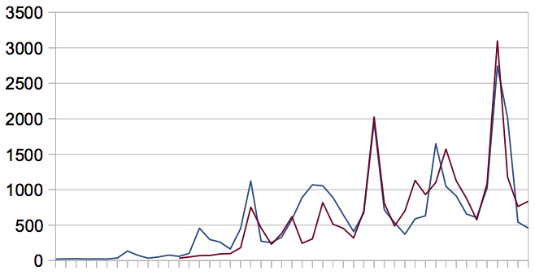

!SLIDE bullets center

# Use Cases #

!SLIDE bullets center

# Future #

* Change from Presentation Driven Development
* Better Optimization
* Confidence intervals
* More statistical methods

!SLIDE center
# Thanks! #

    gem install tealeaves

## Questions? ##
## ~ ##
### Roland Swingler :: @knaveofdiamonds :: LRUG feb 2012 ###